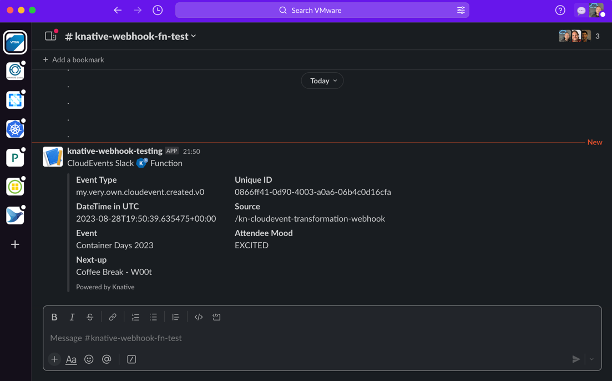

# kn-ps-cloudevent-slack

Example Knative PowerShell function for sending a custom CloudEvent to a Slack webhook. This function relies on the Knative [kn-py-cloudevent-transformation-function](https://github.com/rguske/kn-py-cloudevent-transformation-function) which is a requirement for this example.

# Step 1 - Build

Create the container image locally to test your function logic. Change the IMAGE name accordingly, example below for Docker.

```console
export IMAGE=<docker-username>/kn-ps-cloudevent-slack:1.0
docker build -t ${IMAGE}
```

# Step 2 - Test

Verify the container image works by executing it locally.

Change into the `test` directory

```console
cd test
```

Update the following variable names within the `docker-test-env-variable` file

* SLACK_WEBHOOK_URL - Slack webhook URL
* SLACK_MESSAGE_PRETEXT - Text displayed for Slack notification

Start the container image by running the following command:

```console
docker run -e FUNCTION_DEBUG=true -e PORT=8080 --env-file docker-test-env-variable -it --rm -p 8080:8080 ${IMAGE}
```

In a separate terminal, run either `send-cloudevent-test.ps1` (PowerShell Script) or `send-cloudevent-test.sh` (Bash Script) to simulate a CloudEvent payload being sent to the local container image

```console
Testing Function ...
See docker container console for output

# Output from docker container console
06/27/2022 09:47:31 - DEBUG: K8s Secrets:
{"SLACK_WEBHOOK_URL":"**********","SLACK_MESSAGE_PRETEXT":"Slack :knative: Function"}


06/27/2022 09:47:31 - DEBUG: "{
  attachments = @(
         @{
            pretext = $(${jsonSecrets}.SLACK_MESSAGE_PRETEXT);
            fields = @(
               @{
                  title = "Event Type";
                  value = $cloudEvent.type;
                  short = "false";
               }
               @{
                  title = "Unique ID";
                  value = $cloudEvent.id;
                  short = "false";
               }
               @{
                     title = "DateTime in UTC";
                     value = $cloudEvent.time;
                     short = "false";
               }
               @{
                     title = "Source";
                     value = $cloudEvent.source;
                     short = "false";
               }
               @{
                  title = "Event";
                  value = $cloudEventData.actuator.event.organization;
                  short = "false";
               }
               @{
                  title = "Attendee Mood";
                  value = $cloudEventData.example.attendee.mood;
                  short = "false";
               }
               @{
                  title = "Next-up";
                  value = $cloudEventData.next.up;
                  short = "false";
               }
            )
            footer = "Powered by Knative";
            footer_icon = "https://github.com/knative/docs/blob/main/docs/images/logo/cmyk/knative-logo-cmyk.png";
         }
      )
   }
"
06/27/2022 09:47:31 - Sending Webhook payload to Slack ...
06/27/2022 09:47:31 - Successfully sent Webhook ...
```



# Step 3 - Deploy

> **Note:** The following steps assume a working Knative environment using the RabbitMQ or the `MTChannelBasedBroker` broker. The Knative `service` and `trigger` will be installed in the
`vmware-functions` Kubernetes namespace, assuming that the `broker` is also available there.
>
> **Note:** Also, in order to receive incoming events and to ultimately invoke the kn-ps-cloudevent-slack function, it's necessary to have the [ kn-ps-cloudevent-slack](https://github.com/rguske/kn-py-cloudevent-transformation-function) running first.

Update the `cloudevent_slack_secret.json` file with your Slack webhook configurations and then create the Kubernetes secret which can then be accessed from within the function by using the environment variable named called `SLACK_SECRET`.

```console
# create secret

kubectl -n vmware-functions create secret generic cloudevent-slack-secret --from-file=SLACK_SECRET=cloudevent_slack_secret.json
```

Edit the `function.yaml` file with the name of the container image from Step 1 if you made any changes. If not, the default VMware container image will suffice. By default, the function deployment will filter on the `my.very.own.cloudevent.created.v0` ASOP event. If you wish to change this, update the `type` field within `function.yaml` to the desired event type.

Furthermore, use the Sockeye Event viewer to display all incoming events.

Deploy the function to the Knative environment.

```console
# deploy function

kubectl -n vmware-functions apply -f function.yaml
```

For testing purposes, the `function.yaml` contains the following annotations, which will ensure the Knative Service Pod will always run **exactly** one instance for debugging purposes.

```yaml
annotations:
  autoscaling.knative.dev/maxScale: "1"
  autoscaling.knative.dev/minScale: "1"
```

# Step 4 - Undeploy

```console
# undeploy function

kubectl -n vmware-functions delete -f function.yaml

# delete secret
kubectl -n vmware-functions delete secret asop-slack-secret
```